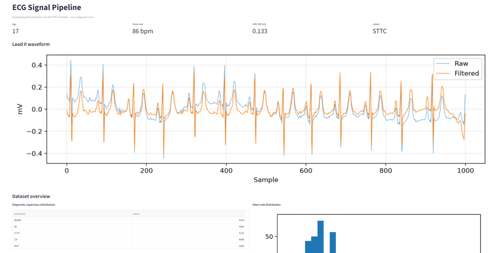
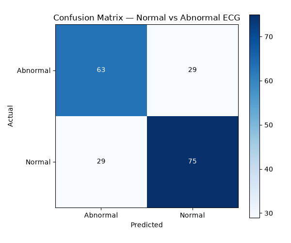
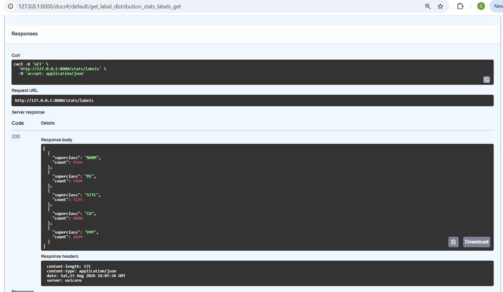

# ECG Signal Pipeline


An end-to-end pipeline over the PTB-XL clinical ECG dataset: ingests 12-lead ECG recordings & metadata, stores them in a normalized PostgreSQL database, extracts interpretable signal features, and trains a baseline classifier with honest evaluation, and serves everything through a REST API and clinical dashboard.

> **Note:** This is an engineering demonstration, not a medical device or
> diagnostic tool. Nothing here is validated for clinical use.



## Tech Stack

- Python
- PostgreSQL
- psycopg
- wfdb
- NumPy
- SciPy
- scikit-learn
- FastAPI
- Streamlit
- Docker
- pytest
- ruff

## Status

- [x] Dockerized PostgreSQL database
- [x] Normalized clinical schema (patients, recordings, multi-label diagnoses)
- [x] ETL pipeline: metadata ingestion with label aggregation
- [x] Signal processing and feature extraction
- [x] Baseline ML classifier with honest evaluation
- [x] REST API
- [x] Clinical-facing dashboard

## Pipeline

Raw 12-lead waveforms are bandpass-filtered (0.5-40 Hz), R-peaks detected on lead II, and interpretable features extracted per record - heart rate, mean RR interval, and heart-rate variability. Extracted heart rates fall in the expected physiological range, validating the signal chain end to end.

## Data

Uses [PTB-XL](https://physionet.org/content/ptb-xl/), a public dataset of
21,799 clinical 12-lead ECGs from ~18,800 patients, released on PhysioNet
under the Creative Commons Attribution license.

> Wagner et al. (2020). *PTB-XL, a large publicly available electrocardiography
> dataset.* Scientific Data. PhysioNet.

The dataset is not redistributed in this repository; it is downloaded directly
from PhysioNet.

## Results

A baseline classifier (random forest over rhythm features) distinguishing normal from abnormal ECGs, evaluated on PTB-XL's official held-out fold 10.

**Features:** heart rate, mean RR interval, RR standard deviation (HRV), patient age and sex.

**Dataset:** 1,526 records with extracted features — 822 normal, 704 abnormal.
Train 1,330 / test 196, split by PTB-XL's `strat_fold` so no patient appears
in both sets.

| Class    | Precision | Recall | F1   | Support |
|----------|-----------|--------|------|---------|
| Abnormal | 0.68      | 0.68   | 0.68 | 92      |
| Normal   | 0.72      | 0.72   | 0.72 | 104     |

**ROC AUC: 0.752**



### Interpreting this honestly

An AUC of 0.75 from rhythm features alone is the expected result, not a
disappointing one. Heart rate and heart-rate variability describe *timing*
between beats, while most abnormalities in PTB-XL — myocardial infarction,
ST/T changes, hypertrophy — are *morphological*, visible in the shape of the
waveform rather than the rhythm. A rhythm-only feature set therefore has a
real ceiling on this task. A model reporting 0.95 here would warrant
suspicion of data leakage rather than celebration.

The clinically relevant number is recall on the abnormal class: **0.68**,
meaning 29 of 92 abnormal ECGs were classified as normal. In any screening
context those false negatives are the costlier error, and a deployed system
would be tuned toward higher abnormal recall at the expense of more false
alarms.

**Next steps** this baseline points to: morphological features (ST-segment
deviation, QRS width, T-wave amplitude), or a model over the raw waveform —
both of which would target the information the current features can't see.

## Installation

```bash
git clone https://github.com/susanyoon/ecg-pipeline.git
cd ecg-pipeline
pip install -e ".[dev]"
cp .env.example .env
docker compose up -d
```

## Usage

```bash
python -c "from ecg.download import download_metadata; download_metadata()"
ecg initdb                      # create the schema
ecg ingest --max-records 21799                      # load metadata, patients, labels
ecg fetch-signals --limit 1500  # download waveforms from PhysioNet
ecg extract --limit 1500        # filter signals, extract features
ecg train                       # train and evaluate the classifier
```

Run the API:

```bash
fastapi dev ecg/api.py          # docs at http://127.0.0.1:8000/docs
```

Run the dashboard:

```bash
streamlit run dashboard.py      # opens at http://localhost:8501
```

## API

A FastAPI service exposes the same data over HTTP, with interactive docs:

